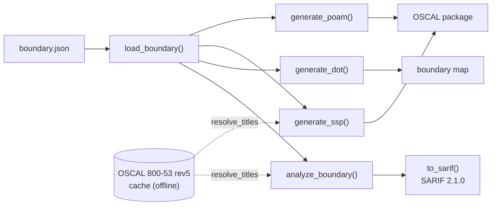
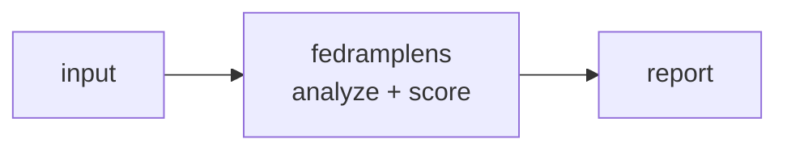

<a name="top"></a>
<div align="center">


# FEDRAMPLENS

### FedRAMP boundary visualizer & OSCAL-format SSP/POAM generator


[](https://pypi.org/project/cognis-fedramplens/) [](https://github.com/cognis-digital/fedramplens/actions) [](LICENSE) [](https://github.com/cognis-digital)

*Federal / Compliance — NIST, CMMC, FedRAMP, and SBIR/GSA workflows.*

</div>

```bash
pip install cognis-fedramplens
fedramplens scan .            # → prioritized findings in seconds
```


<!-- cognis:example:start -->
## 🔎 Example output

Real, reproducible output from the tool — runs offline:

```console
$ fedramplens-emit --version
fedramplens 0.4.9
```

```console
$ fedramplens-emit --help
usage: fedramplens [-h] [--version] [--format {table,json,sarif}]
                   {analyze,diagram,ssp,poam,feeds} ...

FedRAMP boundary visualizer & OSCAL SSP/POA&M generator.

positional arguments:
  {analyze,diagram,ssp,poam,feeds}
    analyze             analyze boundary integrity & coverage
    diagram             emit Graphviz DOT for the boundary
    ssp                 generate OSCAL-style SSP (JSON)
    poam                generate OSCAL-style POA&M (JSON)
    feeds               manage the NIST 800-53 OSCAL data feed
                        (list|update|get)

options:
  -h, --help            show this help message and exit
  --version             show program's version number and exit
  --format {table,json,sarif}
                        output format for analyze: table | json | sarif 2.1.0
                        (default: table; ignored for dot/ssp/poam)
```

> Blocks above are real `fedramplens` output — reproduce them from a clone.

**Sample result format** _(illustrative values — run on your own data for real findings):_

```
{
"feed_id": "1234567890",
"platform": "stix",
"findings": [
    {
        "id": "F-20230201-001",
        "title": "Suspicious Network Traffic",
        "description": "Unusual network traffic detected from 192.168.1.100 to 8.8.8.8",
        "created": "2023-02-01T14:30:00Z"
    },
    {
        "id": "F-20230201-002",
        "title": "Malware Detection",
        "description": "Malware detected on endpoint 192.168.1.100",
        "created": "2023-02-01T14:31:00Z"
    }
]
}
```

<!-- cognis:example:end -->

## Usage — step by step

1. **Install** the tool:

   ```bash
   pip install cognis-fedramplens
   ```

2. **Analyze a boundary** JSON for integrity and control coverage:

   ```bash
   fedramplens analyze boundary.json
   ```

3. **Generate artifacts** from the same boundary file — a Graphviz diagram, an OSCAL-style SSP, or a POA&M:

   ```bash
   fedramplens diagram boundary.json | dot -Tpng -o boundary.png
   fedramplens ssp boundary.json  > ssp.json
   fedramplens poam boundary.json > poam.json
   ```

4. **Read the result.** `analyze` reports impact level, controls implemented vs. baseline (coverage %), boundary components/flows, and open/overdue POA&M items. Add `--format json` for the full summary, or `--format sarif` for a **SARIF 2.1.0** log that uploads straight to GitHub code-scanning. Exit `0` when authorization-ready (no high/critical findings), `1` otherwise.

   ```bash
   fedramplens analyze boundary.json --format sarif > fedramplens.sarif
   ```

5. **Gate in CI.** Fail the pipeline until the boundary is authorization-ready:

   ```bash
   fedramplens analyze boundary.json --format json | jq '.authorization_ready'
   ```

## Demos

Runnable, real-world scenarios live in [`demos/`](demos/). Each folder has a
`boundary.json` in the tool's input format and a `SCENARIO.md` explaining where
the data comes from, the exact command, the expected output, and how to act:

| Demo | Impact | Illustrates |
|---|---|---|
| [`01-basic`](demos/01-basic) | Moderate | Three-tier SaaS with one unencrypted SSO flow + overdue POA&M |
| [`02-clean-low-saas`](demos/02-clean-low-saas) | Low | Authorization-ready baseline (exit 0, empty SARIF) |
| [`03-boundary-creep`](demos/03-boundary-creep) | Moderate | Production data leaving the boundary to a commercial warehouse |
| [`04-overdue-poam-backlog`](demos/04-overdue-poam-backlog) | High | Slipped POA&M milestones + risk roll-up; completed items excluded |
| [`05-dangling-flow-typo`](demos/05-dangling-flow-typo) | Moderate | Flow references an undeclared component (doc drift) |
| [`06-orphan-component`](demos/06-orphan-component) | Low | In-boundary component with no data flows |
| [`07-high-baseline-ready`](demos/07-high-baseline-ready) | High | Clean High-baseline package, SIEM-integrated |
| [`08-bad-poam-date`](demos/08-bad-poam-date) | Moderate | Non-ISO POA&M date surfaced instead of silently ignored |
| [`09-multi-external-deps`](demos/09-multi-external-deps) | Moderate | Multiple external interconnections; one unencrypted ACH flow |
| [`10-oscal-enrichment`](demos/10-oscal-enrichment) | Moderate | Resolve NIST 800-53 rev5 control titles from the OSCAL data feed, offline |

```bash
python -m fedramplens analyze demos/04-overdue-poam-backlog/boundary.json
python -m fedramplens --format sarif analyze demos/03-boundary-creep/boundary.json
python -m fedramplens analyze demos/10-oscal-enrichment/boundary.json --enrich --offline
```

### Runnable scenarios — narrated, by audience

Five self-contained Python walkthroughs in [`demos/`](demos/) drive the **real**
API over the bundled boundary fixtures, fully offline. Each targets a different
audience, prints narrated output, and exits 0 (so they double as smoke tests).
Full write-up in [`docs/DEMOS.md`](docs/DEMOS.md); architecture in
[`docs/ARCHITECTURE.md`](docs/ARCHITECTURE.md).

```bash
PYTHONUTF8=1 python demos/run_all.py            # all five, end to end
PYTHONUTF8=1 python demos/02_assessor_sarif_review.py   # or just one
```

| # | Scenario | Audience | Shows |
|---|---|---|---|
| 1 | [`01_pm_authorization_readiness.py`](demos/01_pm_authorization_readiness.py) | FedRAMP / Agency **PMs** | Portfolio ATO-readiness gate + escalation list |
| 2 | [`02_assessor_sarif_review.py`](demos/02_assessor_sarif_review.py) | **3PAOs / assessors** | Findings as a SARIF 2.1.0 log for code-scanning |
| 3 | [`03_platform_engineer_boundary_map.py`](demos/03_platform_engineer_boundary_map.py) | **Cloud platform engineers** | Mermaid + DOT boundary map; unencrypted crossings (SC-8) |
| 4 | [`04_isso_oscal_packages.py`](demos/04_isso_oscal_packages.py) | **ISSOs** | Generate + inspect the OSCAL SSP and POA&M |
| 5 | [`05_offline_control_enrichment.py`](demos/05_offline_control_enrichment.py) | **ISSOs / air-gap** | Resolve real NIST 800-53 rev5 titles offline; graceful degrade |

One input — a boundary definition — fans out into findings, a visual map,
SARIF, and OSCAL SSP/POA&M:



<a name="data-feeds"></a>
## Data feeds — real NIST 800-53, edge / air-gap deployable

Findings and OSCAL output speak in NIST SP 800-53 control ids (`AC-2`, `SC-8`,
`SC-13`, …). The **data-feed layer** turns those opaque ids into their *official*
control titles by loading the authoritative catalog NIST itself publishes as
native OSCAL JSON.

| Feed id | Source | What it enriches |
|---|---|---|
| `oscal-800-53-rev5-catalog` | NIST SP 800-53 rev5 catalog (OSCAL) — <https://github.com/usnistgov/oscal-content> (`.../SP800-53/rev5/json/NIST_SP-800-53_rev5_catalog.json`) | Resolves every control id in findings + SSP to its real title/family |

The fetcher is **standard-library only** (no pip deps), caches each feed to disk,
and re-serves it **offline** — so the tool keeps working on disconnected,
edge, or air-gapped gear.

```bash
# list the feeds this tool consumes (+ cache freshness)
fedramplens feeds list

# (connected, once) fetch + cache the real NIST catalog
fedramplens feeds update oscal-800-53-rev5-catalog

# print the cached feed without touching the network
fedramplens feeds get oscal-800-53-rev5-catalog --offline

# analyze with control titles resolved straight from the cache
fedramplens analyze boundary.json --enrich --offline
fedramplens ssp     boundary.json --enrich --offline   # titles as OSCAL props
```

If the catalog is unavailable, enrichment **degrades gracefully** — ids are kept
as-is and analysis never fails.

### Air-gap (sneakernet) workflow

Cache on a connected box, carry the snapshot into the enclave, import, run offline:

```bash
# connected jump box
fedramplens feeds update oscal-800-53-rev5-catalog
python -m fedramplens.datafeeds snapshot-export oscal-feeds.tar.gz

# inside the air-gapped enclave
python -m fedramplens.datafeeds snapshot-import oscal-feeds.tar.gz
fedramplens analyze boundary.json --enrich --offline
```

The cache location is configurable via `COGNIS_FEEDS_CACHE` (default
`~/.cache/cognis-feeds`). Tests ship a trimmed catalog fixture and run with zero
network access.

## Contents

- [Why fedramplens?](#why) · [Features](#features) · [Quick start](#quick-start) · [Example](#example) · [Architecture](#architecture) · [AI stack](#ai-stack) · [How it compares](#how-it-compares) · [Integrations](#integrations) · [Install anywhere](#install-anywhere) · [Related](#related) · [Contributing](#contributing)

<a name="why"></a>
## Why fedramplens?

FedRAMP boundary visualizer & OSCAL-format SSP/POAM generator — without standing up heavyweight infrastructure.

`fedramplens` is single-purpose, scriptable, and self-hostable: point it at a target, get prioritized results in the format your workflow already speaks (table · JSON · SARIF), gate CI on it, and let agents drive it over MCP.

<div align="right"><a href="#top">↑ back to top</a></div>

<a name="features"></a>
## Features

- ✅ Load Boundary
- ✅ Analyze Boundary
- ✅ Generate Dot
- ✅ Generate Ssp
- ✅ Generate Poam
- ✅ SARIF 2.1.0 export (`analyze --format sarif`) for GitHub code-scanning
- ✅ Real NIST 800-53 rev5 control-title enrichment via the OSCAL data feed (`--enrich`)
- ✅ Edge / air-gap data feeds: keyless fetch → disk cache → `--offline` re-serve → snapshot export/import
- ✅ Runs on Linux/macOS/Windows · Docker · devcontainer
- ✅ Ports in Python, JavaScript, Go, and Rust (`ports/`)

<div align="right"><a href="#top">↑ back to top</a></div>

<a name="quick-start"></a>
## Quick start

```bash
pip install cognis-fedramplens
fedramplens --version
fedramplens scan .                       # scan current project
fedramplens scan . --format json         # machine-readable
fedramplens scan . --fail-on high        # CI gate (non-zero exit)
```

<div align="right"><a href="#top">↑ back to top</a></div>

<a name="example"></a>
## Example

```text
$ fedramplens scan .
  [HIGH    ] FED-001  example finding             (./src/app.py)
  [MEDIUM  ] FED-002  another signal              (./config.yaml)

  2 findings · risk score 5 · 38ms
```

<div align="right"><a href="#top">↑ back to top</a></div>

<a name="architecture"></a>
## Architecture



<div align="right"><a href="#top">↑ back to top</a></div>

<a name="ai-stack"></a>
## Use it from any AI stack

`fedramplens` is interoperable with every popular way of using AI:

- **MCP server** — `fedramplens mcp` (Claude Desktop, Cursor, Cognis.Studio, [uncensored-fleet](https://github.com/cognis-digital/uncensored-fleet))
- **OpenAI-compatible / JSON** — pipe `fedramplens scan . --format json` into any agent or LLM
- **LangChain · CrewAI · AutoGen · LlamaIndex** — wrap the CLI/JSON as a tool in one line
- **CI / scripts** — exit codes + SARIF for non-AI pipelines

<div align="right"><a href="#top">↑ back to top</a></div>

<a name="how-it-compares"></a>
## How it compares

| | **Cognis fedramplens** | GSA |
|---|:---:|:---:|
| Self-hostable, no account | ✅ | varies |
| Single command, zero config | ✅ | ⚠️ |
| JSON + SARIF for CI | ✅ | varies |
| MCP-native (AI agents) | ✅ | ❌ |
| Polyglot ports (JS/Go/Rust) | ✅ | ❌ |
| Open license | ✅ COCL | varies |

*Built in the spirit of **GSA/fedramp-automation**, re-framed the Cognis way. Missing a credit? Open a PR.*

<div align="right"><a href="#top">↑ back to top</a></div>

<a name="integrations"></a>
## Integrations

Pipes into your stack: **SARIF** for code-scanning, **JSON** for anything, an **MCP server** (`fedramplens mcp`) for AI agents, and a webhook forwarder for SIEM/Slack/Jira. See [`docs/INTEGRATIONS.md`](docs/INTEGRATIONS.md).

<div align="right"><a href="#top">↑ back to top</a></div>

<a name="install-anywhere"></a>
## Install — every way, every platform

```bash
pip install "git+https://github.com/cognis-digital/fedramplens.git"    # pip (works today)
pipx install "git+https://github.com/cognis-digital/fedramplens.git"   # isolated CLI
uv tool install "git+https://github.com/cognis-digital/fedramplens.git" # uv
pip install cognis-fedramplens                                          # PyPI (when published)
docker run --rm ghcr.io/cognis-digital/fedramplens:latest --help        # Docker
brew install cognis-digital/tap/fedramplens                             # Homebrew tap
curl -fsSL https://raw.githubusercontent.com/cognis-digital/fedramplens/main/install.sh | sh
```

| Linux | macOS | Windows | Docker | Cloud |
|---|---|---|---|---|
| `scripts/setup-linux.sh` | `scripts/setup-macos.sh` | `scripts/setup-windows.ps1` | `docker run ghcr.io/cognis-digital/fedramplens` | [DEPLOY.md](docs/DEPLOY.md) (AWS/Azure/GCP/k8s) |

<div align="right"><a href="#top">↑ back to top</a></div>

<a name="related"></a>
## Related Cognis tools

- [`checkpoint-ai`](https://github.com/cognis-digital/checkpoint-ai) — NIST AI RMF / EU AI Act / ISO 42001 self-assessment & SSP generator
- [`cmmcmap`](https://github.com/cognis-digital/cmmcmap) — CMMC Level 2 practice mapper — stack-aware SSP skeleton generator
- [`sbirscout`](https://github.com/cognis-digital/sbirscout) — SBIR/STTR topic discovery — DSIP + SBIR.gov + NIH digest with bid scoring
- [`gsafinder`](https://github.com/cognis-digital/gsafinder) — GSA Schedule opportunity surveyor — SAM.gov + eBuy + FedConnect
- [`clearancepath`](https://github.com/cognis-digital/clearancepath) — Personnel clearance hygiene tracker — SF-86, SEAD-3/4, training currency

**Explore the suite →** [🗂️ all 170+ tools](https://github.com/cognis-digital/cognis-neural-suite) · [⭐ awesome-cognis](https://github.com/cognis-digital/awesome-cognis) · [🔗 cognis-sources](https://github.com/cognis-digital/cognis-sources) · [🤖 uncensored-fleet](https://github.com/cognis-digital/uncensored-fleet) · [🧠 engram](https://github.com/cognis-digital/engram)

<div align="right"><a href="#top">↑ back to top</a></div>

<a name="contributing"></a>
## Contributing

PRs, new rules, and demo scenarios are welcome under the collaboration-pull model — see [CONTRIBUTING.md](CONTRIBUTING.md) and [SECURITY.md](SECURITY.md).

> ### ⭐ If `fedramplens` saved you time, **star it** — it genuinely helps others find it.

## Interoperability

`{}` composes with the 300+ tool Cognis suite — JSON in/out and a shared
OpenAI-compatible `/v1` backbone. See **[INTEROP.md](INTEROP.md)** for the
suite map, composition patterns, and reference stacks.

## License

Source-available under the **Cognis Open Collaboration License (COCL) v1.0** — free for personal, internal-evaluation, research, and educational use; **commercial / production use requires a license** (licensing@cognis.digital). See [LICENSE](LICENSE).

---

<div align="center"><sub><b><a href="https://cognis.digital">Cognis Digital</a></b> · one of 170+ tools in the <a href="https://github.com/cognis-digital/cognis-neural-suite">Cognis Neural Suite</a> · <i>Making Tomorrow Better Today</i></sub></div>
