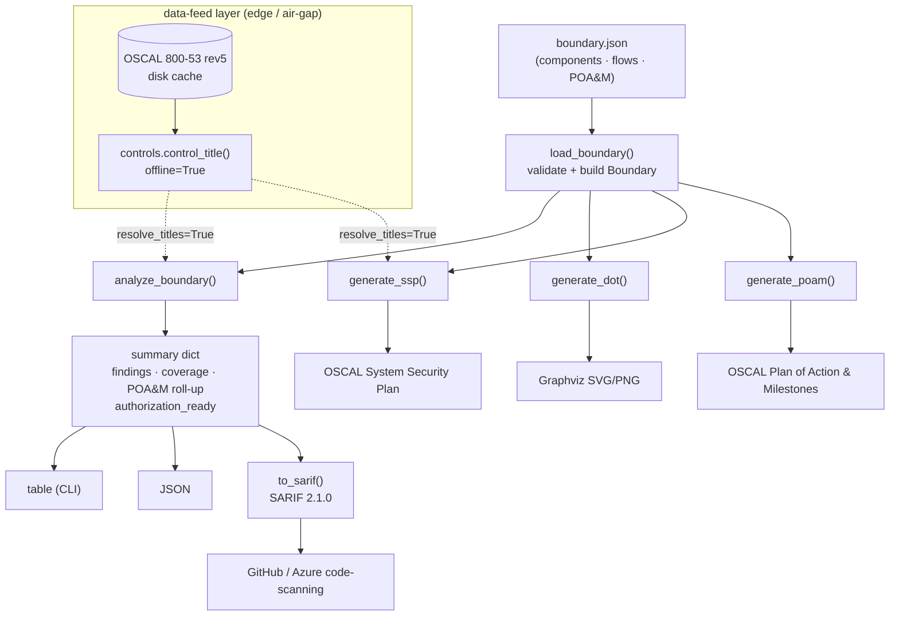

# Architecture

`fedramplens` is a small, dependency-free engine that turns one input — a
**boundary definition** (JSON) — into everything a FedRAMP package needs:
integrity findings, a visual boundary map, a SARIF log for assessor tooling,
and OSCAL-shaped SSP / POA&M artifacts. Optionally it enriches control ids with
the official NIST SP 800-53 rev5 titles from a cached OSCAL catalog that works
offline / air-gapped.

## Boundary → OSCAL flow

## Modules

| Module | Responsibility |
| --- | --- |
| `fedramplens/core.py` | `Boundary` model, `load_boundary`, `analyze_boundary`, `generate_dot`, `generate_ssp`, `generate_poam`, `to_sarif`. No third-party deps. |
| `fedramplens/controls.py` | Resolve NIST SP 800-53 rev5 control titles from the OSCAL catalog; enhancement → base-control fallback; graceful degrade. |
| `fedramplens/datafeeds.py` | Edge/air-gap feed ingestion: HTTPS fetch + disk cache, `offline=True` cache-only serving, sneakernet snapshot export/import. Stdlib `urllib` only. |
| `fedramplens/cli.py` | `analyze` / `diagram` / `ssp` / `poam` / `feeds` subcommands; `--format table\|json\|sarif`; exit 1 when not authorization-ready. |
| `fedramplens/mcp_server.py` | Expose the same operations to AI agents over MCP. |
| `fedramplens/connect.py` | `cognis-connect` Finding emitter (`fedramplens-emit`). |

## Key design properties

- **Single input, many outputs.** Everything derives from the boundary
  definition; there is no hidden state. The same `Boundary` feeds analysis,
  diagrams, SARIF, and OSCAL.
- **Boundary semantics.** A component with `zone == "external"` sits *outside*
  the authorization boundary. Any flow whose endpoints differ in boundary
  membership is a *crossing*; an unencrypted crossing is an SC-8 finding.
- **Deterministic identifiers.** Component / requirement UUIDs are SHA-1 of a
  stable seed, so regenerated OSCAL diffs cleanly in version control.
- **Offline by default for enrichment.** Control-title resolution reads a disk
  cache; with `offline=True` it never touches the network and degrades to
  unchanged ids if the cache is absent — analysis never hard-fails on a missing
  feed.
- **Exit code is a gate.** `analyze` exits non-zero when the package is not
  authorization-ready (any high/critical finding), so it slots into CI.

See [`DEMOS.md`](DEMOS.md) for runnable, audience-specific walkthroughs.
